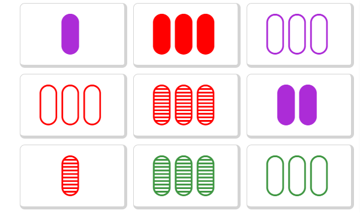

## Modelling End Game Configurations in Set

### Background Information
SET is a pattern recognition card game released in 1991[reference] that is beloved by maths students everywhere. The game uses a special deck of cards, each of which has 4 attributes (colour, shape, number of shapes, shading) each of which have 3 values
* colour can be purple, red, or green
* shape can be diamond, squiggle or oval
* number of shapes can be 1, 2 or 3
* shading can be solid, stripe or open

The aim of the game is to identify "sets" amongst the cards on the table which must satisfy the following rule: 
> "a SET consists of 3 cards in which each of the cards' features, looked at one-by-one, are the same on each card, or, are different on each card. All of the features must seperately satisfy this rule

> In other words: shape must be either the same on all 3 cards, or different on each of the 3 cards; colour must be either the same on all 3 cards or different on all 3 cards, etc.
> If 2 cards are the same and 1 card is different for any attribute, then it is not a SET" 

[reference https://www.setgame.com/sites/default/files/instructions/SET%20INSTRUCTIONS%20-%20ENGLISH.pdf] 
(insert some images as well)

In the standard game of SET, the dealer deals 12 cards onto the table and all players simultaneously look for sets amongst the cards. If none are found, three additional cards are dealt. When a player see's a set, she calls "SET!" and takes the three cards and the dealer lays three more cards onto the table. The game continues like this and ends when all cards the deck is exhausted and there are no more sets on the table. Whoever has collected the most sets at the end of the game is the winner. 

The game invites many questions that are mathematical in nature. For example, how many different sets are possible in the deck? what's the probability that 12 cards contain no sets? what's the maximum number of cards that can be dealt onto the table before there must be a set present? The question that this report aims to answer is to do with how many cards are left on the table at the end of the game that cannot be formed into sets and how likely it is that all the cards form sets and there is none leftover at the end. 

To investigate this question, we will employ a Monte Carlo or stochastic simulation of the game. The Monte Carlo method is a mathematical technique that is used to estimate the probability distribution of the outcome of an uncertain event. The method uses repeated random sampling and the accuracy of the approximation improves as the number of sample increases. Since Monte Carlo methods for solving problems are, in essence, a large number of random experiments conducted by a computer program, they are applied in many fields including statistics, engineering, finance and biology. https://people.smp.uq.edu.au/DirkKroese/mccourse.pdf

We can imagine the cards in Set as a set of points in 4 dimensional space. Each "attribute" on the cards (colour, filling, shape, number) corresponds to an axis in four dimensions and each value for that attribute corresponds to a value along that axis. 

We can generalise the game of SET into higher or lower dimensions by imagining that each "attribute" on the cards (colour, shading, shape, number of shapes) 

For example: 
insert an image of a card

This card can be represented as the vector ("green", "one", "squiggle", "solid"). If we map each value to a digit 0, 1 or 2 (see table below) we can further compress the information contained in this card to (0, 0, 2, 0) 

|Attribute      | Value        | Digit Mapping | 
|---------------| -------------|:-------------:| 
| Colour        | Green        | 0             | 
|               | Purple       | 1             | 
|               | Red          | 2             |  
| Number        | 1            | 0             | 
|               | 2            | 1             | 
|               | 3            | 2             |  
| Shape         | Oval         | 0             | 
|               | Diamond      | 1             | 
|               | Squiggle     | 2             |  
| Shading       | Solid        | 0             | 
|               | Stripe       | 1             | 
|               | Open         | 2             |  

Once the cards have been compressed into a vector, it's easy to imagine a card with any number of dimensions and any number of values per dimension - you just add more elements to the vector and increase the range of digits. For example, we could have a a game of set with 7 attributes each of which had 9 different values. If we used the digits 0-8 to represent the different values for each attribute, a card from this game could be represented as (4, 1, 7, 2, 0, 2, 7) (since the number of the cards is values^dimensions, 9^7 = 4,782,969 which would become a quite long and cumbersome game).

now explain SET(3,3) HERE

The game of SET is governed by chance and probability. Imagining the game in different dimensions naturally invites the question: _Is the probability of particular outcomes in the game SET related to the dimension of the game and the number of values in each dimension?_ This question will be the focus of the rest of this report. 

  
### Introduction
This report is interested in the probability distribution of different configurations of the "end game" of set. That is, what is the probability that there is a particular number of cards left on the board at the end of the game, none of which make sets with any other cards on the board. For now, we will discuss the conventional game of set in which there are 4 dimensions (colour, shape, number, filling) and three possible values for each dimension. From [reference The Joy of Set], we know that if there are more than 20 cards on the board, there must be a set amongst them. Additionally, if all but three cards have been made into sets, the remaining 3 cards _necessarily_ form a set [reference]. Based on these two facts, the possible number of cards left on the board at the end of the game are: 0, 6, 9, 12, 15, 18. 
It has been shown that the game cannot end with 3 cards on the table. 

So, we are left with the following possibilities: 0, 6, 9, 12, 15, 18. 

The probability distribution for the number of cards left on the table in the conventional game of set is well documented [reference the joy of set]. The purpose of this report is to ask the question - is the probability distribution the same in different dimensions of the game?      

### Body

### Future work and references
#### Future work
#### References
1. The Joy of Set
2. [https://www.setgame.com/sites/default/files/teacherscorner/DEVELOPING%20MATHEMATICAL%20REASONING.pdf]
3. https://www.setgame.com/sites/default/files/instructions/SET%20INSTRUCTIONS%20-%20ENGLISH.pdf
4. https://en.wikipedia.org/wiki/Set_(card_game)
